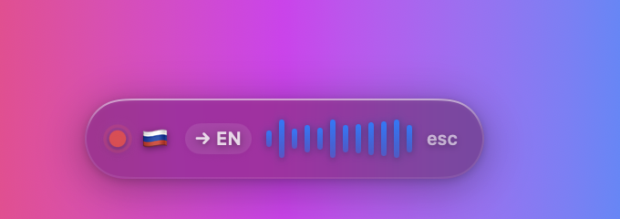
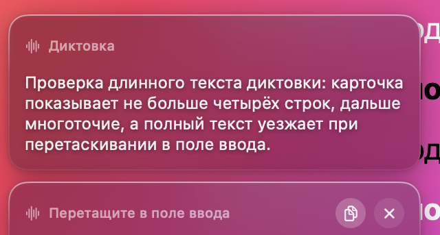
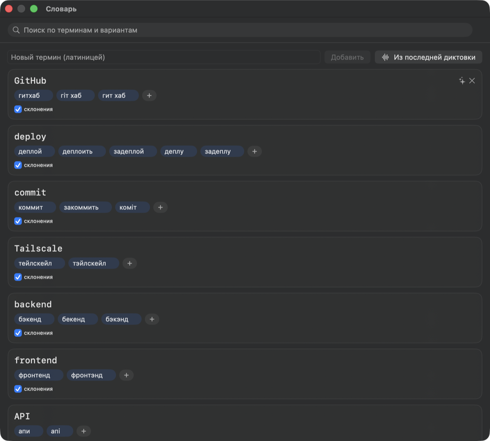

# Transcriber

[](https://github.com/pnazarovich/transcriber/actions/workflows/ci.yml)

**Local Russian/Ukrainian dictation for macOS.** Hold nothing, install nothing in the cloud:
press the right ⌘, speak, and your words land in whatever text field has the cursor.
Speech recognition runs entirely on your Mac's Neural Engine.



| Key | What happens |
| --- | --- |
| **right ⌘** | start dictation / stop it and insert the text |
| **right ⌥** | dictate and translate to English before inserting |
| **Esc** | cancel — nothing is inserted |

A tap counts only if nothing happened between press and release, so `⌘C` and ⌘-click keep
working normally with the same key. Both shortcuts are remappable in Settings.

---

## Why it exists

Cloud dictation is excellent at English and mediocre at everything else — and it ships your
voice to somebody's server. Transcriber targets the opposite corner: Russian and Ukrainian
speech that is full of English technical terms, recognized locally, with the terms coming out
in Latin script the way you would type them (`деплой` → `deploy`, `в гитхабе` → `GitHub`).

## Features

- **Local recognition.** Whisper large-v3 / large-v3-turbo through
  [WhisperKit](https://github.com/argmaxinc/WhisperKit) (CoreML, Apple Neural Engine).
  The language is always forced — Whisper's language detection confuses `uk` with `ru`.
- **Live preview.** A second, tiny Whisper instance transcribes as you speak so the HUD shows
  text within ~0.6 s. The final text is always a full pass of the big model.
- **Three-layer custom dictionary.** Your terms bias the Whisper prompt (layer 1), get
  rewritten by deterministic regexes that understand Russian/Ukrainian case endings
  (layer 2, always local, never fails), and are enforced once more by the GPT pass (layer 3).
- **Optional GPT cleanup.** Punctuation, capitalization, filler removal, and voice commands
  ("new line", "comma"). Authenticate with an OpenAI API key *or* by signing in with your
  ChatGPT account. Turn it off and everything still works — layer 2 is the guarantee.
- **Mixed RU + UK speech.** A toggle that keeps Russian sessions on `large-v3` instead of
  `turbo`, because turbo drops Ukrainian words inserted into Russian sentences.
- **Glass HUD.** A non-activating floating panel — it never steals focus, so the insert always
  goes to the window you were typing in.

  

- **Dictation cards.** No text field focused? The dictation becomes a card near the corner of
  the screen. Drag it into any field later, copy it, translate it, or swipe it away.

  

- **Dictionary editor with suggestions.** Edit terms as cards, generate Cyrillic spellings for
  a new term automatically, and get suggestions mined from words you actually dictate.

  

- **VAD.** Silero VAD via [FluidAudio](https://github.com/FluidInference/FluidAudio) trims
  silence from the edges of every recording (Whisper hallucinates on silence) and can
  optionally auto-stop after 2 s of quiet.
- Menu-bar app (no Dock icon), microphone picker, history of the last dictations,
  custom start/stop chimes, launch at login.

## Requirements

- Apple Silicon Mac (M1 or newer) — CoreML/ANE inference is the whole point.
- macOS 14 or newer.
- ~5 GB of free disk for the Whisper models (`large-v3-turbo` ≈ 1.6 GB, `large-v3` ≈ 3 GB,
  `tiny` for the live preview ≈ 150 MB). They download on first run from Hugging Face.
- Xcode (for the Swift toolchain) to build from source.

## Build and install

```bash
git clone https://github.com/pnazarovich/transcriber.git
cd transcriber
bash scripts/build-app.sh
cp -R dist/Transcriber.app /Applications/
open /Applications/Transcriber.app
```

By default the app is signed **ad-hoc**, which means macOS forgets the microphone and
Accessibility permissions on every rebuild. If you have a signing certificate, pass it:

```bash
security find-identity -v -p codesigning          # find your identity
SIGN_IDENTITY="Apple Development: Jane Doe (ABCDE12345)" bash scripts/build-app.sh
```

> Build the `.app` with `scripts/build-app.sh`, not `swift build`. The script drives
> `xcodebuild`, which is the only way the KeyboardShortcuts resource bundle ends up somewhere
> the SPM accessor can find it at runtime. `swift build` / `swift test` are fine for the
> library and the tests.

The bundle identifier is `online.nazarovych.transcriber` (in `Info.plist`). Change it to your
own reverse-DNS identifier if you plan to distribute your build — it also names the Keychain
service and the `os_log` subsystem.

For a signed, notarized, distributable build, see `scripts/release.sh` (Developer ID signing →
notarization → stapled DMG); every required environment variable is documented at the top of
the script.

## First run

Two system permissions, both requested from the app's **Initial setup…** menu item:

1. **Microphone** — to record you.
2. **Accessibility** — to synthesize the ⌘V that inserts text, and to read the right-⌘ tap.
   Without it the text still lands in the clipboard and the HUD tells you to paste manually.

Then download the models from the same window. Each model is compiled for the Neural Engine
the first time it is loaded — that can take a couple of minutes, once per model.

Optionally, authorize GPT cleanup in **Settings → AI**.

## Privacy

- **Audio never leaves your machine.** Recognition is local; recordings are kept only until the
  text is successfully inserted, then discarded.
- **Text leaves your machine only if you enable GPT cleanup or English translation.** In that
  case the transcript is sent to OpenAI (`api.openai.com`, or the Codex backend when you sign
  in with a ChatGPT account) and nothing else is. With GPT off, the app makes no network
  requests except the one-time model download.
- **Credentials live in the Keychain.** API keys and OAuth tokens are never written to disk in
  plain text.
- The final text is left in the clipboard on purpose — this is deliberate, not a leak.

## Configuration

| What | Where |
| --- | --- |
| Dictionary | `~/Library/Application Support/Transcriber/dictionary.json` |
| Custom sounds | `~/Library/Application Support/Transcriber/sounds/` |
| Everything else | Settings window (hotkeys, language, model, effort, auto-stop, input device) |

The dictionary is watched for changes, so you can edit the JSON in any editor and the app
picks it up. An entry looks like this:

```json
{ "canonical": "GitHub", "variants": ["гитхаб", "гіт хаб"], "stem": true }
```

`stem: true` lets the regex swallow Russian/Ukrainian case endings (`в гитхабе` → `GitHub`).
Set it to `false` for abbreviations and anything whose stem collides with a real word.

Drop your own `start.wav` and `stop.wav` (or `.m4a`/`.mp3`/`.caf`/`.aiff`) into the `sounds`
folder to replace the built-in chimes, which are otherwise synthesized in memory.

## Known limitations

- **Browsers always paste.** Chrome and friends do not expose through the Accessibility API
  whether a text field has focus, so dictations into a browser are pasted rather than routed
  to a card. This is a browser limitation, not a bug here.
- **First load of each model takes minutes** while CoreML compiles it for the Neural Engine.
  Subsequent launches are fast.
- **The App Store is impossible.** The app needs a global event tap and synthetic keystrokes;
  the App Sandbox forbids both. Distribution is Developer ID + notarization only.
- **Mixed-language speech is a compromise.** No Whisper model handles code-switching well;
  the "Mixed RU + UK" toggle just picks the model that degrades most gracefully.
- With macOS "natural scrolling" disabled, the card swipe gesture goes the other way.

## Architecture

```
hotkey ▶ AudioRecorder (AVAudioEngine, 16 kHz mono, pre-warmed)
       ▶ live preview: whisper-tiny, full re-decode every ~0.3 s → HUD
       ▶ stop ▶ VAD trims silence ▶ full pass of the session model (forced language +
                                     dictionary prompt)
       ▶ ReplacementEngine (local, deterministic, 0 ms)
       ▶ PostProcessor (GPT, optional, degrades to the previous step on any failure)
       ▶ clipboard + synthetic ⌘V, or a dictation card if no field has focus
```

Swift package with three targets:

- `TranscriberCore` — everything testable and UI-free: audio, ASR, the dictionary layers, the
  GPT client, text insertion, settings.
- `Transcriber` — the SwiftUI/AppKit app: menu bar, HUD panel, cards, dictionary editor.
- `TranscriberCLI` — runs the whole pipeline over a WAV file, which is how the pipeline is
  exercised without a UI: `swift run TranscriberCLI file.wav --lang ru --no-gpt`.

See `docs/superpowers/specs/` for the design document (in Russian) and `docs/research/` for the
model comparison that led to these choices.

## Credits

- [WhisperKit](https://github.com/argmaxinc/WhisperKit) by Argmax — CoreML Whisper runtime (MIT).
- [FluidAudio](https://github.com/FluidInference/FluidAudio) — Silero VAD on CoreML (Apache-2.0).
- [KeyboardShortcuts](https://github.com/sindresorhus/KeyboardShortcuts) by Sindre Sorhus —
  user-configurable global shortcuts (MIT).
- Whisper models by OpenAI, converted by Argmax and hosted on Hugging Face.

The design was informed by studying how [VoiceInk](https://github.com/Beingpax/VoiceInk),
[Handy](https://github.com/cjpais/Handy) and superwhisper solve the same problems — the
three-layer dictionary in particular is the market consensus. No code was copied from any of
them; VoiceInk is GPL and was read as documentation only.

## License

MIT — see [LICENSE](LICENSE).

---

## По-русски

**Transcriber — локальная диктовка для macOS на русском и украинском.**

Правый **⌘** — начать диктовку, он же — закончить и вставить текст в поле с курсором.
Правый **⌥** — то же самое с переводом на английский. **Esc** — отмена.

Распознавание идёт целиком на вашем Mac (Whisper через WhisperKit, Apple Neural Engine);
звук никуда не уходит. Текст уходит в OpenAI, только если вы включили GPT-чистку или перевод.
Ключи и токены лежат в Keychain.

Главное отличие от облачных диктовок — трёхслойный словарь: программистские термины
выходят латиницей даже в косвенных падежах (`в гитхабе` → `GitHub`, `задеплой` → `deploy`),
и гарантирует это локальный слой регулярок, а не модель.

Нужен Mac на Apple Silicon, macOS 14+, около 5 ГБ под модели и Xcode для сборки:

```bash
bash scripts/build-app.sh
cp -R dist/Transcriber.app /Applications/
```

При первом запуске приложение попросит доступ к микрофону и Accessibility (без него текст
всё равно попадёт в буфер обмена) и предложит скачать модели. Каждая модель один раз
компилируется под нейродвижок — это занимает пару минут.

Словарь живёт в `~/Library/Application Support/Transcriber/dictionary.json` и перечитывается
на лету; свои звуки старта и остановки кладутся в соседнюю папку `sounds/`.
Подробности, ограничения и архитектура — в английской части выше.
